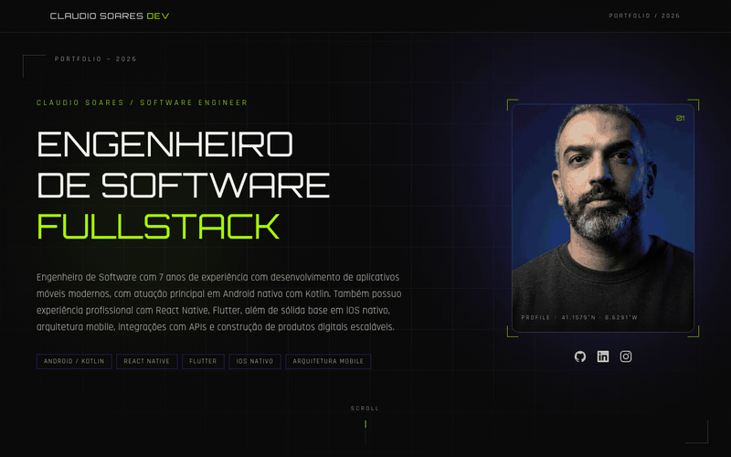

# Claudio Soares — Portfólio

Portfólio pessoal de engenharia de software: home com apresentação em estética
HUD-futurista, carrossel de projetos e página por projeto com showcase 3D de
smartphone dirigido por scroll.



## Stack

| Camada    | Tecnologia |
|-----------|------------|
| Framework | Next.js 16 (App Router, SSG) |
| UI        | React 19, Tailwind CSS v4 |
| Animação  | `motion` v12, View Transitions API |
| 3D        | `three` + `@react-three/fiber` + `@react-three/drei` |
| Carrossel | `embla-carousel-react` + auto-scroll |
| Linguagem | TypeScript |

## Rodando local

```bash
npm install
npm run dev
```

Abra <http://localhost:3000>.

Gate de qualidade (não há test runner na v1):

```bash
npm run lint && npx tsc --noEmit && npm run build
```

## Estrutura

```
content/blog/             # posts do blog, um .md por post
assets/                   # originais NÃO publicados (fora de public/)
  raw/                    # PNGs originais das imagens; fonte do pipeline WebP
  fonts/Orbitron-Bold.ttf # fonte usada ao gerar as imagens de Open Graph
  icon.svg                # marca; fonte dos favicons e ícones do manifest
public/
  og/                     # imagens de Open Graph 1200x630 (geradas)
  profile.json            # conteúdo do hero da home (texto, foto, skills, redes)
  images/profile.webp     # retrato do hero
  icons/                  # ícones 192/512 do web app manifest
  projects/projects.json  # fonte de dados dos projetos
  projects/<slug>/        # cover.webp (9:16) + screen.webp (tela do app)
src/
  app/                    # rotas App Router, sitemap, robots e manifest
  components/home/        # hero + carrossel
  components/project/     # hero do projeto, seções, showcase 3D
  components/layout/      # header, footer, links sociais
  components/seo/         # bloco JSON-LD
  data/                   # loaders + tipos (profile.ts, projects.ts, types.ts)
  lib/                    # site.ts (config canônica), structured-data.ts
scripts/
  generate-seed-assets.mjs  # gerador de arte placeholder (cover/screen)
  optimize-images.mjs       # PNG -> WebP no tamanho de exibição
  generate-og.mjs           # imagens de Open Graph como PNG estáticos
  og-frame.mjs              # layout compartilhado dessas imagens
  generate-icons.mjs        # rasteriza assets/icon.svg nos tamanhos de ícone
  capture-demo.mjs          # captura os frames do GIF de demo
docs/assets/              # mídia usada neste README
```

## Editando o conteúdo

### Apresentação (home)

Tudo no hero vem de `public/profile.json`: `eyebrow`, `title.lines`,
`title.accent`, `description`, `photo`, `skills[]` e `social.{github,linkedin,instagram}`.

### Projetos

Adicionar/remover projeto = editar `public/projects/projects.json` e colocar os
assets em `public/projects/<slug>/`. Não existe registry em TypeScript.

Campos por projeto (`src/data/types.ts`):

- obrigatórios: `slug`, `name`, `tagline`, `description`, `cover`, `screenshot`,
  `device` (`"android"` | `"ios"`), `year`, `role`, `features[]`,
  `architecture.{summary,stack[]}`, `links`
- opcionais: `links.{github,playStore,appStore,website}`, `extras[]`

Assets esperados:

| Arquivo | Dimensão | Uso |
|---------|----------|-----|
| `cover.webp`  | 1080×1920 (9:16) | card do carrossel e hero do projeto |
| `screen.webp` | 1080×2340 | textura da tela do smartphone 3D |

Arte placeholder pode ser regerada com `node scripts/generate-seed-assets.mjs`
(macOS — usa `qlmanage`/`sips` para rasterizar os SVGs).

### Blog

Um post = um arquivo `.md` em `content/blog/`, versionado junto com o código.
Nome do arquivo: `YYYY-MM-DD-slug-em-kebab-case.md` — o slug da URL é o nome
sem o prefixo de data (`/blog/slug-em-kebab-case`).

```md
---
title: "Título do post"
description: "Resumo — vira meta description e texto da listagem."
date: 2026-09-24          # obrigatório, YYYY-MM-DD
updated: 2026-10-02       # opcional
tags: [android, kotlin]   # opcional
draft: true               # opcional — só aparece em `npm run dev`
cover: /blog/slug/cover.webp  # opcional — imagem do JSON-LD
---

Corpo em markdown (GFM: tabelas, listas de tarefa, blocos de código com
destaque de sintaxe no build).
```

A data vale do frontmatter, não do git: o checkout do CI é raso e não tem o
histórico. Campo obrigatório faltando ou data inválida quebram o build com a
mensagem apontando o arquivo.

Imagens do post vão em `public/blog/<slug>/` e são referenciadas com caminho da
raiz (``) — o basePath é aplicado na conversão. PNG
passa pelo `npm run images` como o resto do site.

A listagem pagina de 10 em 10 (`POSTS_PER_PAGE` em `src/data/posts.ts`): `/blog`
é a página 1 e `/blog/page/2`, `/blog/page/3`… são geradas conforme o número de
posts.

Publicar: criar o `.md`, rodar `npm run og` (gera `public/og/blog/<slug>.png`),
commitar e dar push. Também saem automaticamente `/blog/rss.xml` e as entradas
no sitemap.

### Pipeline de imagem

Solte o PNG em `public/` e rode:

```bash
npm run images
```

O script arquiva o original em `assets/raw/` (que não é publicado), grava o
WebP no tamanho de exibição em `public/` e remove o PNG servido. Depois é só
apontar o JSON para o `.webp`. Rodar de novo sempre parte do original
arquivado, então não há perda por recompressão. `npm run images:check` falha
se algum WebP estiver faltando — bom para o CI.

Isso não é cosmético: em `output: "export"` não existe o otimizador da Next, e
o que está em `public/` é literalmente o que o browser baixa. O pipeline levou
os assets de 5,7 MB para 288 KB.

### Marca e ícones

`assets/icon.svg` é a fonte. `npm run icons` gera `src/app/icon.svg`,
`src/app/apple-icon.png` e os ícones do manifest em `public/icons/`.

> As páginas são estáticas (SSG). Em dev o JSON é relido a cada request; em
> produção, editar o JSON exige `npm run build`.

## Regerando o GIF de demo

O `docs/assets/demo.gif` é gerado a partir da build de produção — o script
`scripts/capture-demo.mjs` (Playwright) percorre home → primeiro projeto →
showcase 3D → volta para a home, capturando um PNG por passo:

```bash
npm run build
npx next start -p 3111 &
BASE_URL=http://localhost:3111 node scripts/capture-demo.mjs --out /tmp/demo-frames

ffmpeg -y -framerate 20 -i /tmp/demo-frames/frame-%04d.png \
  -vf "fps=12,scale=800:-1:flags=lanczos,split[a][b];\
[a]palettegen=max_colors=96:stats_mode=diff[p];\
[b][p]paletteuse=dither=bayer:bayer_scale=4:diff_mode=rectangle" \
  -loop 0 docs/assets/demo.gif
```

Flags do script: `--out <dir>`, `--width` (padrão 1280), `--height` (padrão 800).
Subir `fps`/`scale`/`max_colors` melhora a imagem e engorda o arquivo — o preset
acima fica em ~3,7 MB para ~10 s.

## SEO

A configuração canônica fica em `src/lib/site.ts` — URL, títulos, locale e cor
de tema saem todos dali. **Defina `NEXT_PUBLIC_SITE_URL` no ambiente de build**
se o domínio for diferente do padrão: é essa URL que resolve o `canonical` e as
URLs absolutas de Open Graph.

O que é gerado automaticamente a partir dos JSON de conteúdo:

- `/sitemap.xml` e `/robots.txt` (`src/app/sitemap.ts`, `src/app/robots.ts`)
- `/manifest.webmanifest`
- JSON-LD `Person` + `WebSite` na home, `SoftwareApplication` +
  `BreadcrumbList` em cada projeto e `Blog`/`BlogPosting` no blog
  (`src/lib/structured-data.ts`)
- `/blog/rss.xml` (`src/app/blog/rss.xml/route.ts`)

Imagens de Open Graph 1200×630 (home, uma por projeto, índice do blog e uma
por post) são geradas
por `npm run og` em `public/og/`, desenhadas com `next/og` usando a Orbitron
versionada em `assets/fonts/`. `npm run og:check` falha se faltar alguma.

São PNG estáticos, e não a convenção `opengraph-image.tsx` da Next, de
propósito: no export aquela convenção emite arquivos sem extensão, que o
GitHub Pages serve como `application/octet-stream` — e aí o scraper do
LinkedIn/Facebook recusa a imagem. Rode `npm run og` sempre que mudar título,
tagline ou stack de um projeto.

## Deploy

GitHub Pages, via `.github/workflows/deploy.yml` — todo push em `main` builda e
publica. `output: "export"` gera `out/`, que é o artefato enviado.

A URL é `https://claudiosoaresdev.github.io/portfolio/`, ou seja, o site não
fica na raiz do domínio. O workflow passa duas variáveis vindas do próprio
`actions/configure-pages`, então nada é fixado no código:

| Variável | Valor | Para quê |
|---|---|---|
| `NEXT_PUBLIC_BASE_PATH` | `/portfolio` | `basePath`/`assetPrefix` e o `assetPath()` de `src/lib/site.ts` |
| `NEXT_PUBLIC_SITE_URL` | `https://claudiosoaresdev.github.io/portfolio` | canonical, Open Graph, sitemap, JSON-LD |

Três detalhes do Pages que o código já cobre:

- `public/.nojekyll` — sem ele o Jekyll descarta tudo que começa com `_`,
  incluindo a pasta `_next/` inteira
- `trailingSlash: true` — o Pages não tem regra de rewrite, então só a forma
  `/rota/index.html` resolve sem 404
- `assetPath()` nas imagens e na textura do WebGL — com `images.unoptimized`,
  `next/image` não prefixa o basePath sozinho, e o `useTexture` do drei faz
  fetch direto, fora do roteador

Para rodar o build do Pages localmente:

```bash
NEXT_PUBLIC_BASE_PATH=/portfolio \
NEXT_PUBLIC_SITE_URL=https://claudiosoaresdev.github.io/portfolio \
npm run build
npx serve out   # ou sirva out/ sob o caminho /portfolio
```

## Changelog

Mudanças notáveis em [`CHANGELOG.md`](CHANGELOG.md) (Keep a Changelog + SemVer).
